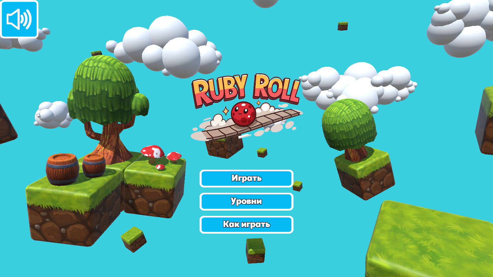
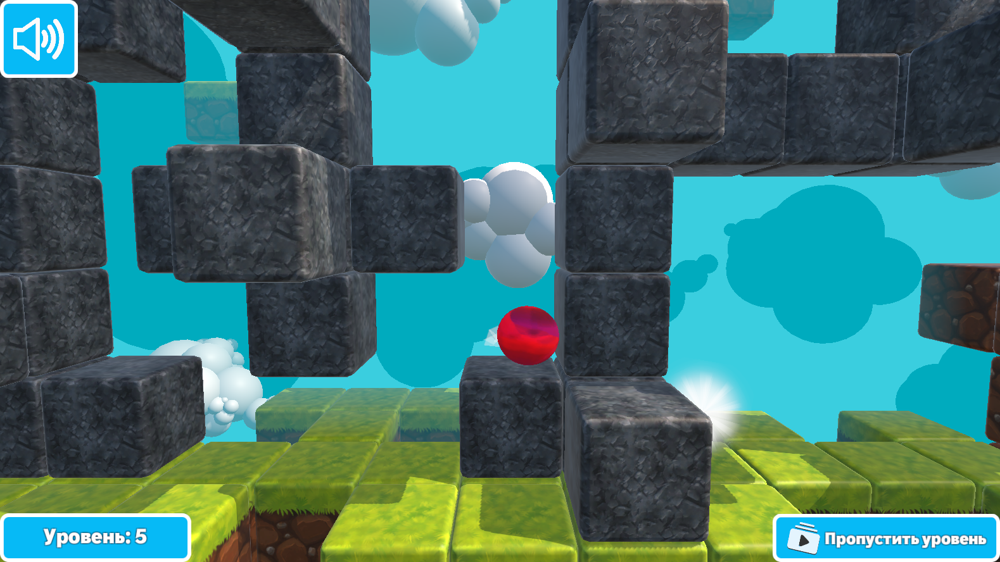
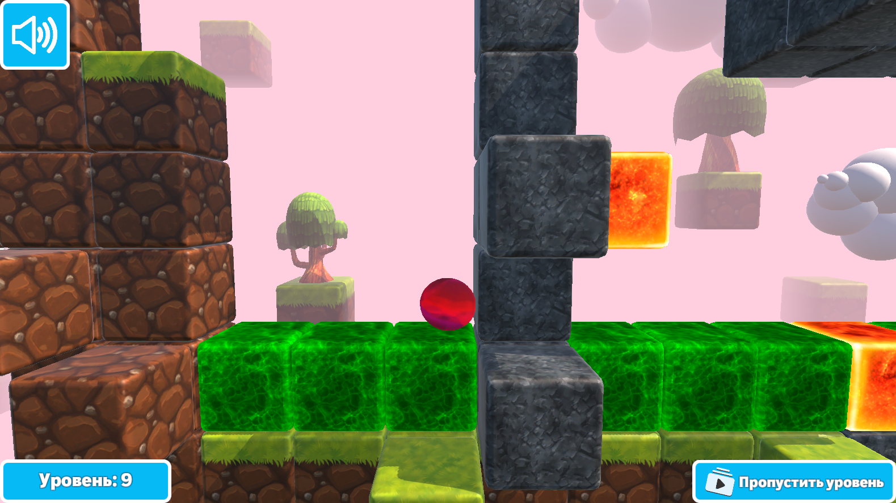
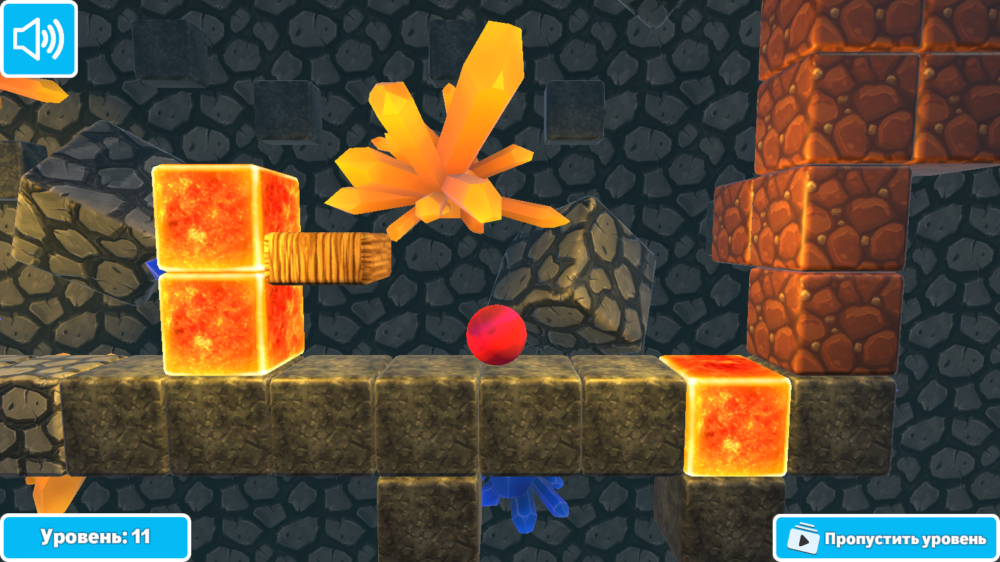

Вот финальная версия `README.md` с разделом для скриншотов:

# Ruby Roll - 2.5D Platformer

  

## Описание игры

**Ruby Roll** — это захватывающий 2.5D платформер, где вы управляете шариком по имени Руби через серию сложных испытаний. Пройдите через опасные уровни, преодолевайте препятствия в этом красочном мире.

## Управление

- **Пробел** — Прыжок
- **A/D или ←/→** — Движение влево/вправо
- **R** — Перезапустить текущий уровень
- **Esc** — Открыть/закрыть меню паузы

## Особенности игры

- Уникальная 2.5D графика
- Разнообразные уровни с увеличивающейся сложностью
- Физика шарика с реалистичным движением и инерцией
- Система локализации (Русская, English)
- Система сохранения прогрессии

## Запуск проекта для разработки

1. Убедитесь, что у вас установлена **Unity версии 6000.0.38f1**
2. Клонируйте репозиторий или скачайте проект
3. Откройте Unity Hub
4. Нажмите "Open" и выберите папку с проектом
5. Дождитесь окончания импорта ассетов
6. Откройте сцену `Assets/Scenes/SelectLanguage.unity` (или другую стартовую сцену)
7. Нажмите Play в редакторе Unity для тестирования

## Скриншоты и медиа

Полную галерею скриншотов и геймплейных видео можно посмотреть по ссылке:  
[Посмотреть все скриншоты игры](https://github.com/BagmanG/Ball-Game-Platformer/tree/main/Screenshots)  

  
*(Главное меню)*

  
*(Первый тип уровней)*

  
*(Второй тип уровней)*

  
*(Третий тип уровней)*

## Сборка игры

1. Перейдите в `File > Build Settings`
2. Выберите платформу (Windows, Mac, Linux, Web)
3. Нажмите "Build" и выберите папку для сохранения

## Системные требования

**Для запуска в редакторе:**
- **ОС**: Windows 10/11 или macOS 10.14+
- **Unity**: версия 6000.0.38f1
- **Память**: 8 GB RAM (рекомендуется 16 GB)
- **Видеокарта**: с поддержкой DirectX 11/Metal

**Для собранной версии:**
- **ОС**: Windows 8.1+, macOS 10.13+, Linux
- **Память**: 4 GB RAM
- **Видеокарта**: Intel HD Graphics 4000 или лучше

## Структура проекта

```
Assets/
├── Sounds/         # Звуковые эффекты и музыка
├── Materials/      # Материалы
├── Prefabs/        # Префабы
├── Scripts/        # C# скрипты
├── Scenes/         # Игровые сцены
├── Levels/         # Уровни
├── Fonts/          # Шрифты
└── ...             # Другие папки
```

## Контакты

По вопросам сотрудничества и предложениям:  
Email: [zagr.gadel@gmail.com](mailto:zagr.gadel@gmail.com)  
Telegram: @bagman2020

## Лицензия

Этот проект лицензирован по лицензии [MIT]